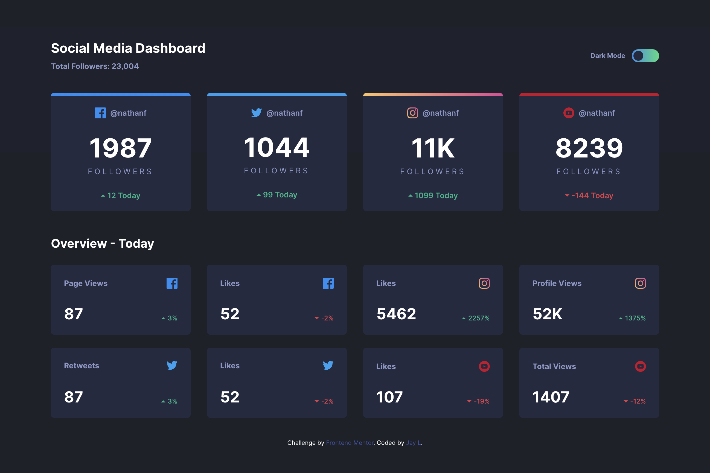

# Social Media Dashboard

This is a solution to the [Social media dashboard with theme switcher challenge on Frontend Mentor](https://www.frontendmentor.io/challenges/social-media-dashboard-with-theme-switcher-6oY8ozp_H).

## Table of contents

- [Overview](#overview)
  - [The challenge](#the-challenge)
  - [Screenshot](#screenshot)
  - [Links](#links)
- [My process](#my-process)
  - [Built with](#built-with)
  - [What I learned](#what-i-learned)
  - [Continued development](#continued-development)

**Note: Delete this note and update the table of contents based on what sections you keep.**

## Overview

### The challenge

Users should be able to:

- View the optimal layout for the site depending on their device's screen size
- See hover states for all interactive elements on the page
- Toggle color theme to their preference

### Screenshot

### Links

- Solution URL: [https://github.com/jaylspace/social-media-dashboard](https://github.com/jaylspace/social-media-dashboard)
- Live Site URL: [https://social-media-dashboard-jayl.vercel.app](https://social-media-dashboard-jayl.vercel.app)

## My process

### Built with

- Semantic HTML5 markup
- CSS custom properties
- Flexbox
- CSS Grid

### What I learned

I tried using `figure` element in HTML, but not sure whether I did it right. This challenge was mostly about CSS Grid so I went for almost all of the main biggest layouts. For the Overview section, `grid-template-areas` was so helpful to customize grid item's location.

### Continued development

Will try to look for more `figure` usecases and learn about them more.
